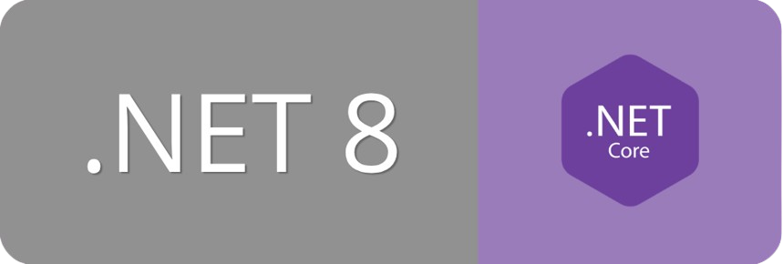
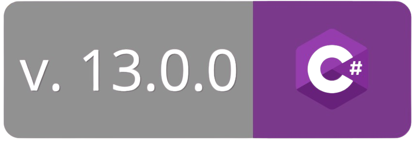
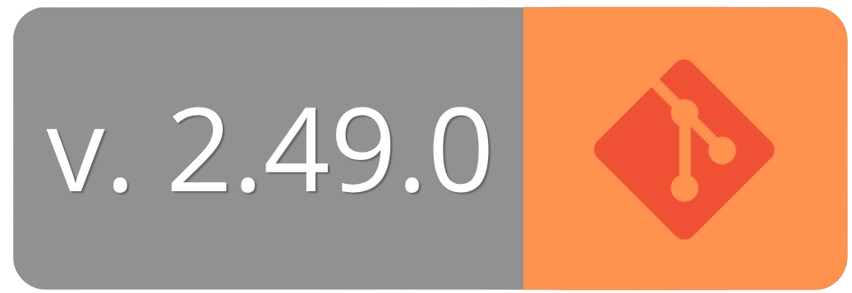

<h1 align="center">Calculadora</h1>
<p align="center">
  <a href="https://learn.microsoft.com/es-es/dotnet/">
    
  </a>
  <a href="https://learn.microsoft.com/en-us/dotnet/csharp/">
    
  </a>
  <a href="https://learn.microsoft.com/es-es/visualstudio/xaml-tools/?view=visualstudio">
    
  </a>
  <a href="https://git-scm.com/docs">
    
  </a>
</p>

## Introducció

El projecte **"Calculadora"** és una aplicació interactiva que permet realitzar les operacions matemàtiques bàsiques (sumar, restar, multiplicar i dividir) de manera senzilla, ja sigui fent servir el teclat o fent clic directament als botons de la pantalla.

- **Doble mètode d'entrada:**
  
> Ofereix una gran comoditat de l'usuari en permetre operar tant de manera tàctil/clic amb els botons de la pantalla com de forma ràpida a través del teclat físic.

- **Interfície intuïtiva i neta:**
  
> El disseny visual està pensat perquè qualsevol persona pugui utilitzar l'aplicació a l'instant, sense complicacions ni elements que distreguin.

## Contribuidors

<div align="center">
  <a href="https://github.com/AbrilVilalta">
    <br/>
    <b>AbrilVilalta</b>
  </a>
</div>

###### **Projecte realitzat en el marc de 1r CFGS a l'institut Teknós, 2026.**
###### Aquest projecte esta sota la llicència **MIT**.

## Índex

- [Requisits del Sistema](#requisits-del-sistema)
- [Funcionalitats Principals](#funcionalitats-principals)
- [Guia d'Instal·lació](#guia-dinstallació)
- [Guia d'ús amb explicació pas a pas](#guia-dús-amb-explicació-pas-a-pas)
- [Exemples d'ús i Captures de Pantalla](#exemples-dús-i-captures-de-pantalla)
- [Conclusions i reflexions sobre el projecte](#conclusions-i-reflexions-sobre-el-projecte)

## Requisits del Sistema

| Requisit | Detall |
|---|---|
| Sistema operatiu | Windows 10 / 11 (64-bit) |
| .NET Runtime | [.NET 8.0](https://dotnet.microsoft.com/download/dotnet/8.0) |
| RAM | 512 MB mínim, 2 GB recomanat |
| Espai en disc | ~50 MB |

## Funcionalitats Principals

- **Operacions simples**:
  - **Suma**: Addició de dos o més números.
  - **Resta**: Subtracció de dos o més números.
  - **Multiplicació**: Multiplicació de dos o més números.
  - **Divisió**: Divisió de dos números.
- **Operacions encadenades**:
  -  Permet fer càlculs com 1+3-4 seguits.
  - **Prioritat d'operadors**: Respecta l'ordre matemàtic (*, / abans que +, -).
- **Entrada**:
  - **Entrada per teclat**: Operar directament amb el teclat físic.
  - **Entrada per botons**: Operar fent clic als botons de la pantalla.
- **Boto de neteja**: Boto que neteja la pantalla
- **Divisió per zero**: Gestió d'errors en dividir per zero

## Guia d’Instal·lació

1. Clona o descarrega el repositori.
```
git clone https://github.com/AbrilVilalta/Calculadora.git
```
3. Obre el **Visual Studio**.
4. Ves a `Fitxer` → `Obre` → `Projecte/Solució`.
5. Selecciona el fitxer `Calculadora.sln`.
6. Clica el botó **Iniciar** o prem `F5` per executar.

## Guia d’ús amb explicació pas a pas

1. **Introdueix el primer número** fent clic als botons o usant el teclat
2. **Selecciona l'operació** (`+`, `-`, `*`, `/`)
3. **Introdueix el segon número**
4. **Prem `=`** o la tecla `Enter` per obtenir el resultat
5. **Prem `C`** per netejar i fer un nou càlcul

> **Notes**: Pots encadenar operacions sense necessitat de prémer `=` entre cada una.

## Exemples d’ús i Captures de Pantalla

## Conclusions i reflexions sobre el projecte

El desenvolupament d'aquesta calculadora ens ha permès posar en pràctica els conceptes
apresos durant el curs, com ara la creació d'interfícies gràfiques amb XAML i la lògica
de programació amb C#.
